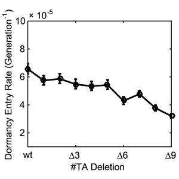

<table><tbody>
  <tr>
    <td style="width:100px">

      
    
</td> 
    <td style="padding-left:20px">
      K.R. Jacobson, A.M. Saleh, S.N. Lipp, <strong>C. Tian</strong>, A.R. Watson, C.M. Luetkemeyer, A.R. Ocken, S.L. Spencer, T.L. Kinzer-Ursem, S. Calve.
      <strong>Extracellular matrix protein composition dynamically changes during murine forelimb development</strong>
      <em>iScience.</em> <strong>27</strong>: 108838 (2024).
      [<a href="https://doi.org/10.1016/j.isci.2024.108838">Link</a>]
    </td>
  </tr>
  <tr>
    <td style="width:100px">

      
    
</td> 
    <td style="padding-left:20px">
      J.Y. Chen, C. Hug, J. Reyes, <strong>C. Tian</strong>, L. Gerosa, F. Fr&#246;hlich, B. Ponsioen, H.J.G. Snippert, S.L. Spencer, A. Jambhekar, P.K. Sorger, G. Lahav. 
      <strong>Multi range ERK responses shape the proliferative trajectory of single cells following oncogene induced senescence.</strong> 
      <em>Cell. Rep.</em> <strong>42</strong>: 112252 (2023). 
      [<a href="https://doi.org/10.1016/j.celrep.2023.112252">Link</a>]
    </td>
  </tr>
  <tr>
    <td style="width:100px">

        
    
</td> 
    <td style="padding-left:20px">
      C. Yang,* <strong>C. Tian</strong>,* T. Hoffman,* N. Jacobsen, S. Spencer. 
      <strong>Melanoma subpopulations that rapidly escape MAPK pathway inhibition incur DNA damage and rely on stress signalling.</strong> 
      <em>Nat. Commun.</em> <strong>12</strong>: 1747 (2021). (*: equal contribution) 
      [<a href="https://doi.org/10.1038/s41467-021-21549-x">Link</a>]
    </td>
  </tr>
  <tr>
    <td style="width:100px">

        
    
</td> 
    <td style="padding-left:20px">
      <strong>C. Tian</strong>,* C. Yang,* S. Spencer. 
      <strong>EllipTrack: a global-local cell-tracking pipeline for 2D fluorescence time-lapse microscopy.</strong> 
      <em>Cell. Rep.</em> <strong>32</strong>: 107984 (2020). 
      [<a href="https://doi.org/10.1016/j.celrep.2020.107984">Link</a>]
    </td>
  </tr>
  <tr>
    <td style="width:100px">

      
    
</td> 
    <td style="padding-left:20px">
      M. Min, Y. Rong, <strong>C. Tian</strong>, S. Spencer. 
      <strong>Temporal integration of mitogen history in mother cells controls proliferation of daughter cells.</strong> 
      <em>Science.</em> <strong>368</strong>: aay8241 (2020). 
      [<a href="https://doi.org/10.1126/science.aay8241">Link</a>]
    </td>
  </tr>
  <tr>
    <td style="width:100px">

      
    
</td> 
    <td style="padding-left:20px">
      R. Fu, A. Gillen, R. Sheridan, <strong>C. Tian</strong>, M. Daya, Y. Hao, J. Hesselberth, K. Riemondy. 
      <strong>clustifyr: An R package for automated single-cell RNA sequencing cluster classification.</strong> 
      <em>F1000Res.</em> <strong>9</strong>: 223 (2020). 
      [<a href="https://doi.org/10.12688/f1000research.22969.2">Link</a>]
    </td>
  </tr>
  <tr>
    <td style="width:100px">

      
    
</td> 
    <td style="padding-left:20px">
      I. Miller, M. Min, C. Yang, <strong>C. Tian</strong>, S. Gookin, D. Carter, S. Spencer. 
      <strong>Ki67 is a Graded Rather than a Binary Marker of Proliferation versus Quiescence.</strong> 
      <em>Cell. Rep.</em> <strong>24</strong>: 1105-1112 (2018). 
      [<a href="https://doi.org/10.1016/j.celrep.2018.06.110">Link</a>]
    </td>
  </tr>
  <tr>
    <td style="width:100px">

        
    
</td> 
    <td style="padding-left:20px">
      <strong>C. Tian</strong>, S. Semsey, N. Mitarai. 
      <strong>Synchronized switching of multiple Toxin–Antitoxin modules by (p) ppGpp fluctuation.</strong> 
      <em>Nucleic. Acids. Res.</em> <strong>45</strong>: 8180-8189 (2017). 
      [<a href="https://doi.org/10.1093/nar/gkx552">Link</a>]
    </td>
  </tr>
  <tr>
    <td style="width:100px">

      
    
</td> 
    <td style="padding-left:20px">
      R.A. Kellogg,* <strong>C. Tian</strong>,* M. Etzrodt, S. Tay. 
      <strong>Cellular Decision Making by Non-Integrative Processing of TLR Inputs.</strong> 
      <em>Cell. Rep.</em> <strong>19</strong>: 125-135 (2017). 
      [<a href="https://doi.org/10.1016/j.celrep.2017.03.027">Link</a>]
    </td>
  </tr>
  <tr>
    <td style="width:100px">

       
    
</td> 
    <td style="padding-left:20px">
      <strong>C. Tian</strong>,* M. Roghanian,* M.G. Jorgensen, K. Sneppen, M.A. S&#248;rensen, K. Gerdes, N. Mitarai. 
      <strong>Rapid curtailing of the stringent response by Toxin-Antitoxin-encoded mRNases.</strong> 
      <em>J. Bacteriol.</em> <strong>198</strong>: 1918-1926 (2016). 
      [<a href="https://doi.org/10.1128/jb.00062-16">Link</a>]
    </td>
  </tr>
  <tr>
    <td style="width:100px">

       
    
</td> 
    <td style="padding-left:20px">
      <strong>C. Tian</strong>, N. Mitarai. 
      <strong>Bifurcation of transition paths induced by coupled bistable systems.</strong> 
      <em>J. Chem. Phys.</em> <strong>144</strong>: 215102 (2016). 
      [<a href="https://doi.org/10.1063/1.4953242">Link</a>]
    </td>
  </tr>
  <tr>
    <td style="width:100px">

        
    
</td> 
    <td style="padding-left:20px">
      R.A. Kellogg, <strong>C. Tian</strong>, T. Lipniacki, S.R. Quake, S. Tay. 
      <strong>Digital signaling decouples activation probability and population heterogeneity.</strong> 
      <em>eLife</em> <strong>4</strong>: e08931 (2015). 
      [<a href="https://doi.org/10.7554/elife.08931">Link</a>]
    </td>
  </tr>
  <tr>
    <td style="width:100px">

      
    
</td> 
    <td style="padding-left:20px">
      H. Zhang, M. Lin, H. Shi, W. Ji, L. Huang, X. Zhang, S. Shen, R. Gao, S. Wu, <strong>C. Tian</strong>, Z. Yang, G. Zhang, S. He, H. Wang, T. Saw, Y. Chen, Q. Ouyang. 
      <strong>Programming a Pavlovian-like conditioning circuit in Escherichia coli.</strong> 
      <em>Nat. Commun.</em> <strong>5</strong>:3102 (2014). 
      [<a href="https://doi.org/10.1038/ncomms4102">Link</a>]
    </td>
  </tr>
</tbody></table>

