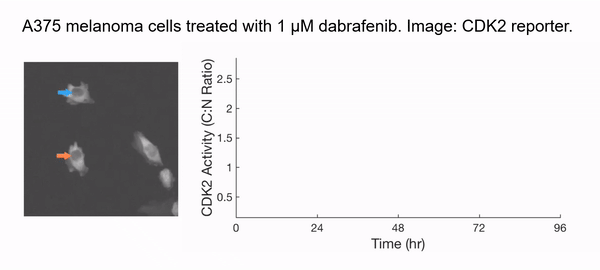
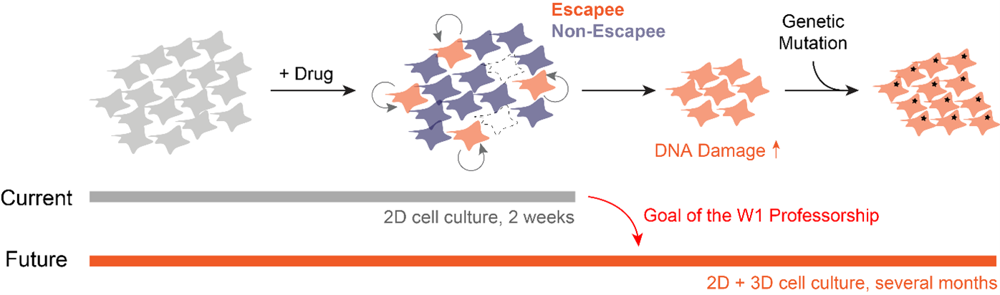

<h4>Background</h4>

Cancer is a leading cause of death. While effective targeted therapies are commerically available for many cancer types, cancer inevitably strieks back, typically via a few cells acquiring genetic mutations that bypass the oncogenic inhibition. Understanding <b>which</b> and <b>how</b> cells acquire such resistance will greatly facilite the development of therapies that better expand patients' quantity and quality of life. 

While single cancer cells can now be accurately profiled at fixed timepoints, little is known about the temporal dynamics inbetween.

 recent technical advances enables accurate profiling of single cancer cells at fixed timepoints, little is known about the temporal dynamics inbetween. To overcome this critical limitation, my collaborators and I developed innovative time-lapse microscopy and automated image-analysis algorithms (<a href="/publication">Yang <em>et al. Nat Commun</em> 2021; Tian <em>et al. Cell Rep</em> 2020</a>), allowing us for the first time to continuously monitor thousands of single drug-treated cancer cells in their native states over two weeks. Applying them to BRAF-driven melanoma cells, we identified an unexpected subpopulation ("escapees") that rapidly escaped the action of clinically approved BRAF inhibitors and entered a slow-cycling state via non-genetic mechanisms. While these cells out-proliferated non-escapees, they harbored increased DNA damage and thus were more likely to acquire new genetic mutations. Together, our work demonstrate that escapees could be the seed population driving cancer recurrence.

<h4>Current Research</h4>

The overarching goal of our research is to systematically characterize single drug-treated cancer cells throughout the entire timeline of recurrence, from the time of drug addition to the formation of resistant colonies. Specifically, we will pursue three research directions.

<b>Expanding the boundaries of long-term time-lapse microscopy across space and time.</b> We will develop experimental and computational techniques that enable month-long monitoring of single cancer cells in both 2D and 3D <em>in-vitro</em> settings. Experimentally, we will develop novel culturing models, live-cell reporters, and microscopy techniques that accurately measure the activity of signaling pathways without high toxicity on the cells. Computationally, I will incorporate state-of-the-art deep-learning approaches to improve the speed and the accuracy of cell-tracking algorithms. All advances will be documented and shared according to the FAIR principles.

<b>Identifying the dynamics and sequences of events by which cancer recurrence emerges.</b> Combining our imaging techniques that measure a few signaling pathways' activities over time with single-cell sequencing techniques taht measure thousands of genes at single timepoints, we will identify the signaling pathways driving the drug escaping at each characteristic timescale. Classical cell-biology and genetic approaches will the help dissect the detailed molecular mechanisms and identify novel therapeutic targets.

<b>Towards model-guided optimal scheduling of therapy administration.</b> Administering high doses of targeted therapies, despite effective, significantly reduces patients' quality of life. Innovative approaches, such as dose-escalating and intermittent ("on-off") treatments, have thus been increasingly implemented in the clinics. Yet, current dosing schedules are often designed without understanding the underlying single-cell behaviors, such that they do not always result in improved outcomes. We will fill this gap by systematically quantify the single-cell responses to dosage shift via time-lapse microscopy, followed by computational modeling to identify the optimal dosing schedules that minimize the residual cancer population without high overall toxicity to the patients.

