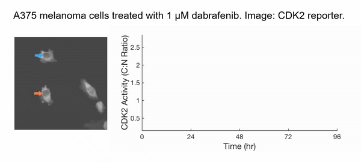

<h4>Background</h4>

Cancer is a leading cause of death. While targeted therapies show promising results, cancer inevitably strikes back, typically via a few cells acquiring genetic mutations that bypass the oncogenic inhibition. Identifying <b>which</b> cells and <b>how</b> they acquire such resistance will greatly facilitate the development of higher-efficacy therapies and the maintenance of human well-being.

Instead of taking the traditional approach of profiling cancer cells at fixed time points and inferring the cell behaviors in between (very challenging and subjected to errors!), we decided to <b>directly observe</b> how each cell responds to the drug action. We have developed innovative time-lapse microscopy and automated image-analysis algorithms, allowing us to continuously monitor thousands of single drug-treated cancer cells in their native state over two weeks. This represents an order-of-magnitude improvement over the state-of-the-art, both in the number of monitored cells and in the imaging duration. Applying them to BRAF-driven melanoma cells, we identified an unexpected subpopulation ("escapees") that rapidly escaped the action of clinically approved BRAF inhibitors and entered a slow-cycling state via non-genetic mechanisms. Escapees naturally out-proliferated non-dividing cells, yet they harbored increased DNA damage and thus were more likely to mutate. Our work thus suggests that escapees could represent the seed population driving the eventual acquisition of permanent drug resistance. Escapees have also been observed across diverse cancer and drug types, indicating the broad applicability and clinical relevance of our work.

<h4>Current Research</h4>

We will expand our approach and perform the first in-depth single-cell longitudinal characterization across the <b>entire timeline of cancer recurrence</b>, from drug addition to the formation of resistant colonies. Our research will thus fundamentally shift our view of this critical process. Our research consists of three interdependent pillars.

 

<b>Technology Development.</b> Factors such as the spectral overlap of live-cell reporters, phototoxicity, and the accuracy of cell tracking limit the applicability of time-lapse microscopy. We will overcome them both experimentally (e.g., by developing new culturing models) and computationally (e.g., by incorporating deep learning methods for cell tracking). Our goal is to reliably monitor single drug-treated cancer cells over months, both in 2D and 3D <em>in-vitro</em> settings.

<b>Molecular Mechanisms.</b> By combining time-lapse microscopy, single-cell sequencing, and classical cell biology and genetic approaches, we will delineate the detailed molecular mechanisms driving drug escaping at each characteristic timescale. This pillar will unravel the dynamics and sequences of events by which cancer recurrence emerges and will facilitate the identification of novel therapeutic targets.

<b>Therapeutic Optimization.</b> The dosages and timings of therapeutic administration strongly impact the clinical outcomes, yet they are less addressed in basic research. Through imaging and computational modeling, we will systematically quantify how these parameters impact the evolution of tumor sizes and identify the scenario that leads to the minimal residual population without high overall toxicity to the patients. Our work constitutes an important step towards model-guided optimal scheduling of therapeutic administration.
 

